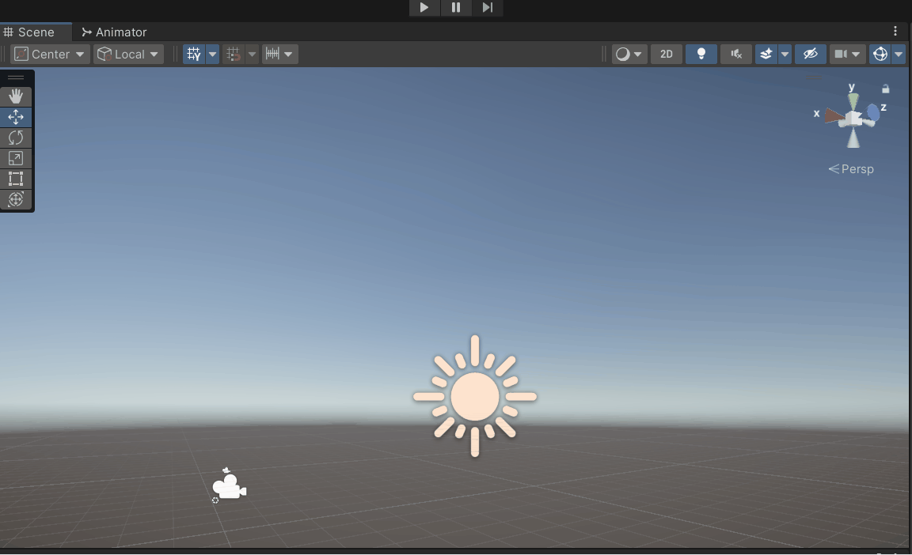

# M5_PROG

## Opdracht 1 bal ##
Opdracht was om de bal op random plekken te spawnen met random kleuren

[link](Prog_Opdrachten/Assets/Scripts/Ball.cs)

# leerjaar 1 opdrachten

## opdracht 1 Gameobject besturen met script ##
opdracht is om cube te laten bewegen

 

[link](Prog_Opdrachten\Assets\Scripts\AddForce.cs)

